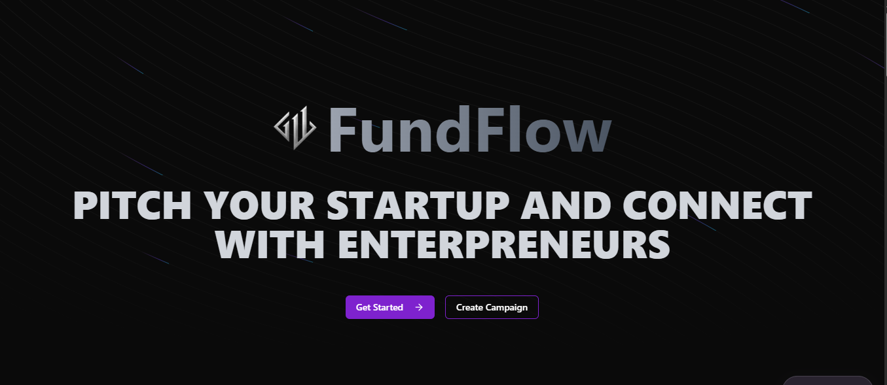
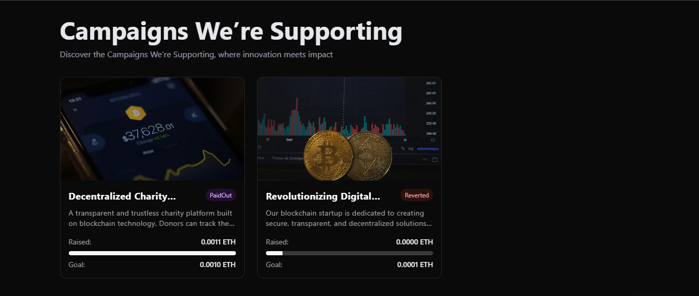
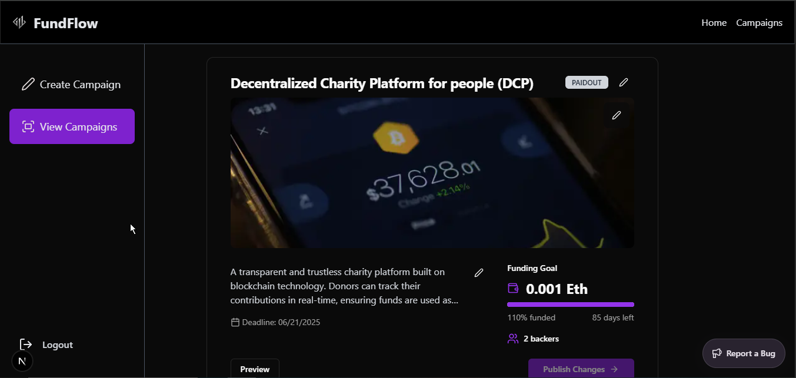

### 🚀 Decentralized FundFlow Platform

FundFlow – Decentralized Crowdfunding for Startups

FundFlow is a decentralized funding platform built on Ethereum, enabling startup owners to showcase their projects and receive backing from investors transparently. Entrepreneurs can submit project details, and backers can fund promising ideas using Ethereum (Sepolia testnet for testing purposes).

This full-stack DApp leverages Next.js, Ethers.js, and MetaMask integration for secure and seamless transactions. Backed funds are held until the project is fully funded, after which they are released with a 5% platform fee deducted.

[](https://github.com/MuhammadBilal0111/fundflow)  

<div align="center">
    
    
    
    
    
    
    
</div>

## Features
- **Next.js 15**: The latest version of Next.js for optimized performance.
- **TypeScript**: Ensures type safety and better development experience.
- **ShadCN & Aceternity UI**: Provides elegant and customizable UI components.
- **Sentry**: Error monitoring and tracking for application stability.
- **Ethers.js**: Facilitates Ethereum-based transactions.
- **MetaMask Integration**: Enables users to send and receive funds securely.
- **Hardhat**: Used for deploying smart contracts efficiently.
- **Solidity**: Smart contracts are written in Solidity for Ethereum blockchain integration.
- **Cloudinary**: Used for storing images.
- **Clerk**: Authenticating with Metamask.


## Getting Started
Ensure you have the necessary environment variables in place before running the project.

### Prerequisites
- MetaMask Wallet
- Ethereum Test Network (e.g., Sepolia)

### Environment Variables
Create a `.env.local` file and add the following credentials:

```env
CLOUDINARY_CLOUD_NAME=
CLOUDINARY_API_KEY=
CLOUDINARY_API_SECRET=
NEXT_PUBLIC_CLERK_PUBLISHABLE_KEY=
CLERK_SECRET_KEY=
NEXT_PUBLIC_CLERK_SIGN_IN_URL=/sign-in
NEXT_PUBLIC_CLERK_SIGN_IN_FALLBACK_REDIRECT_URL=/
NEXT_PUBLIC_CLERK_SIGN_UP_FALLBACK_REDIRECT_URL=/
```

Additionally, ensure that the Sentry authentication token is stored in the `.env.sentry-build-plugin` file:

```env
SENTRY_AUTH_TOKEN=
```
---
## Installation

Clone the repository and install dependencies:

```sh
git clone https://github.com/MuhammadBilal0111/fundflow.git
cd fundflow
npm install
```

## Running the Project

Run the development server:

```sh
npm run dev
```

## Smart Contract Deployment

FundFlow uses smart contracts written in Solidity. You can deploy these contracts using Hardhat.

Compile and deploy your smart contract to the Ethereum network (e.g., Sepolia):

```
cd contract
npx hardhat compile
npx hardhat run scripts/deploy.js --network sepolia
```
### Deploy Smart Contract to Sepolia Testnet

#### Configure Network (Etherscan, MetaMask, Alchemy API Keys)

Modify `hardhat.config.js` to include:

```js
module.exports = {
  solidity: "0.8.28",
  etherscan: {
    apiKey: {
      sepolia: <ETHERSCAN_API_KEY>,
    },
  },
  networks: {
    sepolia: {
      url: `https://eth-sepolia.g.alchemy.com/v2/${<ALCHEMY_API_KEY>}`,
      accounts: <SEPOLIA_PRIVATE_KEY>,
    },
};
```

## ScreenShots
---

## Images
Below are some screenshots of the platform:

### Home Page


### Campaigns


### Edit Campaigns


### Demo
---
[](https://github.com/user-attachments/assets/27ca449f-b41b-4b1a-84df-c0a0cd63717e)

## License
This project is licensed under the MIT License.

Enjoy building! 🚀
